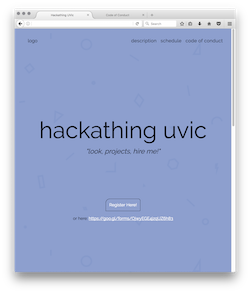
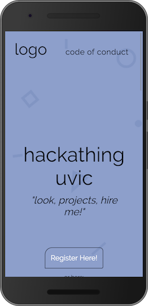

# Hackathing UVic 2017

Hackathing UVic 2017 Website

## Getting Started

How to do the thing





### Prerequisites

Things you will need in order to contribute.

```
Git
Github Account

Terminal
Text Editor
```

## Built With

* HTML/CSS
* Github

## Contributing

```
Create your feature branch: git checkout -b myUserName-featureName
Commit your changes: git commit -m "Added a thing"
Push to the branch: git push origin myUserName-featureName
Submit a pull request :D
```

## Authors

* **Amy** - *Initial work* - [amyhanv](https://github.com/amyhanv)
* **Dominique** - *Initial work* - [FlyteWizard](https://github.com/FlyteWizard)
* **Kaitlin** - *Initial work* - [k-erby](https://github.com/k-erby)

## Acknowledgments

* Hat tip to anyone who's code was used
* Inspiration
* Background Pictures
* etc
